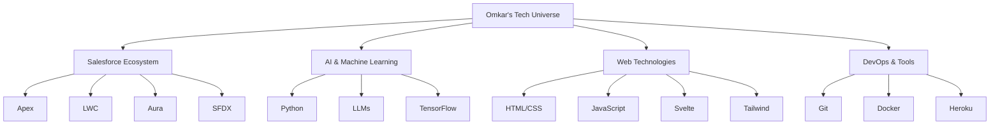

# 👋 Hello, I'm Omkar Kadam

## 🚀 Senior Software Engineer | Salesforce Expert | AI Enthusiast | Web Design Aficionado

Architecting the future, one line of code at a time. I'm passionate about crafting elegant solutions at the intersection of Salesforce, AI, and cutting-edge web technologies.

### 🛠️ Tech Stack

### 🏆 Highlights

- 🌟 Delivering high-quality Salesforce solutions
- 🚀 Significantly improved salesforce ecosystem with innovative system integrations
- 🤖 Pioneered the integration of LLMs and AI models into Salesforce environments

### 🎓 Continuous Learning

- 📚 Currently pursuing Masters in AI/ML
- 🏅 Multiple Salesforce Certifications

### 🌱 Current Focus

- 🔮 Exploring the potential of LLMs in enhancing Salesforce capabilities
- 🐍 Diving deeper into Python for data processing and ML applications
- 🎨 Crafting intuitive and beautiful web interfaces with modern frameworks

### 📫 Let's Connect!

I'm always eager to collaborate on innovative projects or discuss the latest in tech. Feel free to reach out!

- 📧 Email: omkarkadam237@gmail.com

---

> "The best way to predict the future is to invent it." - Alan Kay
